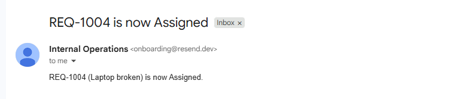
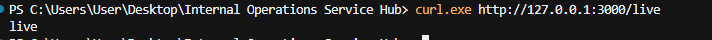
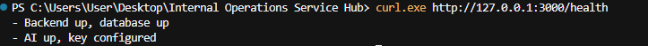
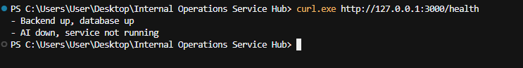
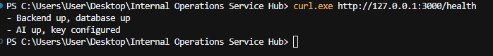
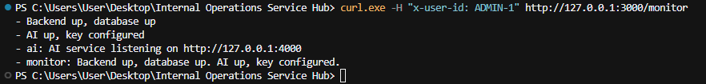
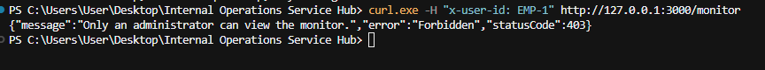
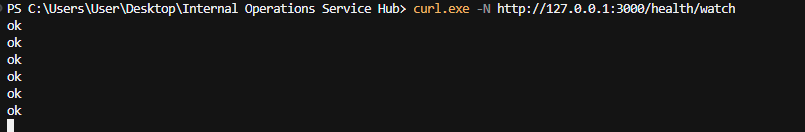
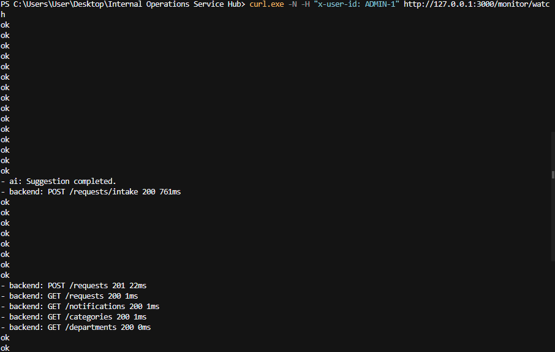
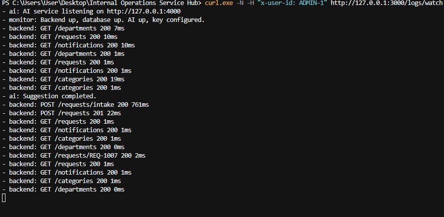

# Week 5 — Release

This week I finished the hub and put it somewhere that does not need my laptop. The same repository is the one that runs. An employee can submit a request, a department can handle it, and the data stays after the service sleeps.

## What I finished

The earlier weeks already had submit, status, and Suggest. I closed the rest of the business rules around that.

A request still moves in order: Submitted, Assigned, In Progress, then either Waiting for Approval or straight on, then Approved or Rejected, then Resolved, then Closed. A jump that skips a step is refused. The person who submitted a request cannot update it. Only the department employee of that request's current department can change the status or move it. Approve and Reject belong to the approver who was assigned, and that person cannot approve their own request.

When a request is In Progress, the department employee decides if it needs approval and picks the approver. That check is theirs. Suggest never decides it.

If the request was sent to the wrong department, that department's employee can transfer it while it is still Submitted, Assigned, or In Progress. The category becomes the other department's Other category. A comment records the move, for example `Transferred from IT to HR.` After that, the old department cannot open it. A closed request cannot be transferred.

## Notices

Notices are inside the app, on the Notices tab. They are not email.

- The department employee is told when a new request arrives.
- The person who submitted it is told when the status changes, when someone comments, and when it is transferred.
- The approver is told when a request is waiting for them.
- After Approve or Reject, the department staff are told they can resolve it or close it.
- The new department is told when a request is transferred to them.

Each person only sees their own notices.

## Email

There is a tick on the new-request form: send status updates by email. If it is ticked, a status change also tries to send mail through Resend. I used the free Resend account, so the mail only arrives at my own email to show the trigger works.

I tried it as Yorgo Kozhaya (`EMP-4`). His address is my own email, `yorgokozhaya1111@gmail.com`. I submitted a request with the box ticked. When the status changed, the email arrived.



If the key is missing, or if Resend fails, the status is still saved. The mail is skipped. A company would put this on a paid mail service, with the company domain as the sender, so it can write to every employee. I did not pay for that.

## The administrator

Elie Boustany (`ADMIN-1`) is the administrator. He is responsible for the system, not for the work inside a request.

He can see every request: the id, the status, the department, and who submitted it. He can add people. He can add or rename departments and categories. He is the only person who can open the monitor and the logs.       

He cannot see the title, the description, the category, or the comments. He does not change the status, he does not approve or reject, and he does not transfer a request. Those stay with the department employee and the assigned approver.

On the screen, switch **Acting as** to Elie Boustany. The request list shows blank titles. Users and Departments appear only for him.

## Before the deploy

I treated the commit I was about to deploy as the staged candidate. I did not point Render at a half-finished copy.

The final smoke test was on this laptop, with the AI process and the API running:

- `GET /live` returns `live`. The API is up. This check does not ask the database or the AI.
- `GET /health` returns `Backend up, database up` and `AI up, key configured`.
- Suggest still only suggests. Submit is what saves.
- A bad AI reply, or a stopped AI process, does not create a request. The rest of the hub still works.
- The backend tests and the browser test were already green.

Render uses `/live` as its health check. `/health` is stricter on purpose. If the AI process dies, `/health` returns 503, and Render does not keep restarting the whole service because of that. Suggest fails until the AI process is back. Submit, lists, notices, and status changes keep working.

`/live` answers once. It does not ask the database or the AI.

```powershell
curl.exe http://127.0.0.1:3000/live
```



`/health` answers once, with the AI process running.

```powershell
curl.exe http://127.0.0.1:3000/health
```



## Failure and recovery

I stopped the AI process and left the API running. `/live` still returns `live`, so Render would not restart the service for this. `/health` returns 503 and names the AI as down. Suggest cannot finish. Submit, lists, notices, and status changes still work, because they never call that process.

```powershell
curl.exe http://127.0.0.1:3000/health
```



I started the AI process again with `npm start` in the `ai` folder. The same health check comes back up. Suggest works again.

```powershell
curl.exe http://127.0.0.1:3000/health
```



## Monitor

The monitor is not a tab on the page. Elie opens it with the `x-user-id` header set to `ADMIN-1`. It repeats the health lines, then the recent log lines. Anyone else gets `Only an administrator can view the monitor.`

Elie:

```powershell
curl.exe -H "x-user-id: ADMIN-1" http://127.0.0.1:3000/monitor
```



Someone who is not the administrator:

```powershell
curl.exe -H "x-user-id: EMP-1" http://127.0.0.1:3000/monitor
```



`/logs` is the same rule, without the health lines at the top. It answers once and stops.

The watch addresses stay open. About once a second they print again, until I press Ctrl+C. I called them with `curl.exe -N` so each line showed up immediately.

`/health/watch` needs no user id. While the database and the AI process are up, the line is `ok`. If one of them is down, the next line names it, for example `AI down, service not running`.

```powershell
curl.exe -N http://127.0.0.1:3000/health/watch
```



`/monitor/watch` is Elie only, header `x-user-id: ADMIN-1`. It prints `ok` every second, and it adds a log line when something new is recorded. Anyone else is refused, the same way `/monitor` refuses them.

```powershell
curl.exe -N -H "x-user-id: ADMIN-1" http://127.0.0.1:3000/monitor/watch
```



`/logs/watch` is Elie only as well. It prints log lines, not the `ok` line. It does not by itself say that a service is down. That is what `/health/watch` and `/monitor/watch` are for.

```powershell
curl.exe -N -H "x-user-id: ADMIN-1" http://127.0.0.1:3000/logs/watch
```



## Files this release added

`render.yaml` is the Render blueprint. It creates the free Postgres database `operations-db` and the free web service `operations-hub`. The build is `npm run build`. The start is `npm start`. The health check path is `/live`. The Groq key and the Resend key are listed with `sync: false`, so the values stay in the Render dashboard and are not stored in Git.

`scripts/start-render.mjs` is what `npm start` runs on Render. It refuses to start unless `DATABASE_URL` is a Postgres URL. It applies `backend/prisma/schema.postgres.prisma`, runs the empty-database seed, starts the AI process on port 4000, then starts the API. The API serves the built React app, so the browser and the API share one address. `AI_BASE_URL` is `http://127.0.0.1:4000`, which is that machine talking to itself.

`backend/src/seed-if-empty.ts` counts the users. If any exist, it leaves the requests alone. The full seed deletes rows, so it must not run on every boot. The first boot loads the demo people. A later restart or redeploy does not wipe what people submitted.

`backend/prisma/schema.postgres.prisma` is the same models as the local schema, with Postgres as the provider. The laptop keeps `backend/prisma/schema.prisma` on SQLite, so the tests do not need Postgres.

`backend/.env.example` and `ai/.env.example` list the variable names only. The real keys stay in `backend/.env` and `ai/.env`, which are gitignored.

## Deployment

The live service is one free Render web service, `operations-hub`, plus one free Render Postgres database, `operations-db`. I did not pick a paid plan.

I kept SQLite on the laptop. I did not keep it on Render. The free web service has no disk that survives sleep, restart, or a new deploy. A SQLite file would disappear. Postgres is the free way to keep the requests. The database itself is free for 30 days from the day it was created. The dashboard shows that date.

The free web service sleeps after about 15 minutes with nobody using it, then takes about a minute to wake. The requests are in Postgres, so sleep does not delete them.

The first boot seeds the demo people only because the user table is empty. After that, seed does not run again.

## If this grows later

These are not in the hub today. They are what I would add if the company outgrew this release.

If the database got large and the storage filled up, I would put a cache in front of the reads that happen all the time, such as the request list and the department list. The cache would answer those without reading the database every time. The database would still be the place that stores the request. If the cache were down, the API would read the database directly.

If the database itself were down, a bigger deployment would keep a second database that is a live copy of the first. That copy is a replica. It stays updated from the original. When the original is down, the app uses the copy until the original is back. This hub has one database. I am not running a replica on the free plan.
